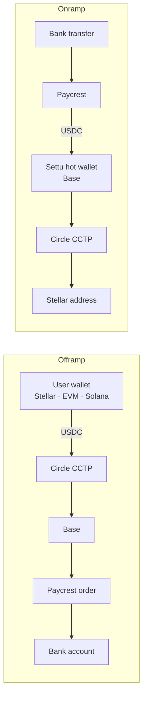

<p align="center">
  <picture>
    <source media="(prefers-color-scheme: dark)" srcset="public/brand/settu-logo.svg">
    <source media="(prefers-color-scheme: light)" srcset="public/brand/settu-logo-light.svg">
    
  </picture>
</p>

<h3 align="center">Settu stablecoins and fiat, seamlessly.</h3>

<p align="center">
  Stablecoins in, cash out, in minutes. No P2P traders. No middlemen.<br>
  Settu moves money between <b>USDC</b> and <b>your bank account</b>, in both directions.
</p>

<p align="center">
  <a href="https://www.settu.xyz"><b>settu.xyz</b></a> ·
  <a href="https://www.settu.xyz/app">Open the app</a> ·
  <a href="https://www.instagram.com/settu.official1">Instagram</a>
</p>

---

## What Settu does

**Offramp: USDC → bank account**
Send USDC from Stellar, Base, Ethereum, Arbitrum, Optimism, Avalanche, Polygon or Solana. Settu bridges it with Circle's CCTP, then pays out to a verified bank account through Paycrest. You see the rate and fees before you sign.

**Onramp: bank transfer → Stellar USDC**
Pay into a virtual account. Settu receives the settled USDC on Base and bridges it to your Stellar address, or any Stellar address you choose.

**Settu Agent**
Type what you want ("send 50 USDC to my GTBank account") and the agent turns it into a ready-to-confirm order. You still review and sign every transfer.

**Built to be trusted with money**
- Every transfer is tracked server-side and survives a closed tab.
- A stuck transfer is held and flagged, never silently retried or refunded. It's recovered from Telegram or the admin console.
- A burn sweep runs every 5 minutes, so a USDC burn left mid-bridge is recovered while the user is still watching.

## How it works



- **Base is the hub.** Paycrest settles and pays out on Base, so every other chain bridges through it with CCTP. USDC sent from Base itself skips the bridge.
- **The onramp is custodial for a short window.** Paycrest has no native Stellar support, so onramp USDC briefly sits in Settu's Base hot wallet before it's bridged on. If that step fails (for example, the wallet runs low on gas), funds stay put, the order is marked `bridge_failed`, and a Telegram alert asks a human to step in.
- **Allbridge is legacy.** It carried both bridge legs before the CCTP cutover. It's still wired in only so pre-cutover orders can finish.

## Tech stack

| Layer | What we use |
| --- | --- |
| App | Next.js 15 (App Router), React 19, TypeScript, Tailwind CSS v4 |
| Wallets | Stellar Wallets Kit (desktop extensions), WalletConnect (mobile), Reown AppKit (EVM + Solana) |
| Bridging | Circle CCTP V2 (Stellar, Solana and six EVM chains ⇄ Base), viem, Stellar SDK, Anchor |
| Payouts | Paycrest (quotes, bank verification, payout and onramp orders) |
| Agent | Vercel AI SDK + Gemini |
| State | Upstash Redis: orders, bridge progress, history, notifications, stats |
| Ops | Telegram alerts and `/retry`, admin recovery console, Vercel Cron, GitHub Actions |

## Project map

```
src/
  app/
    page.tsx               landing page (/)
    app/                   the product (/app): onramp, offramp, agent, history, help
    admin/                 recovery console for stranded transfers
    api/                   offramp, onramp, bridge, webhooks, cron, admin routes
  components/
    brand/                 SettuLogo, SettuMark, SettuLoader
    app/                   app shell, flows, agent UI
    landing/               landing-page sections
  lib/
    cctp/                  Circle CCTP: burns, attestations, mints, retries
    offramp/  onramp/      order flows, settlement, agent resolvers
    stellar/  evm/  solana/  wallet adapters and transaction builders
    admin/  stats/  notifications/  ledger/
public/brand/              logo and mark as SVG
```

## Getting started

```bash
npm install
cp .env.example .env.local   # fill in the values below
npm run dev                  # http://localhost:3000
```

Use `npm run dev:https` when testing on a phone. Mobile wallets connect over WalletConnect, which needs a secure origin.

### Environment

`.env.example` documents every variable. The groups:

| Area | Variables |
| --- | --- |
| Paycrest | `PAYCREST_API_KEY`, `PAYCREST_WEBHOOK_SECRET` |
| Offramp (Base side) | `BASE_PRIVATE_KEY`, `BASE_RETURN_ADDRESS`, `NEXT_PUBLIC_BASE_RETURN_ADDRESS` |
| Source chains | `NEXT_PUBLIC_OFFRAMP_SOURCE_CHAINS_ENABLED` (comma-separated allowlist, e.g. `base,arbitrum,solana`), plus `*_RPC_URL` for Base, Ethereum, Arbitrum, Optimism, Avalanche, Polygon and Solana |
| Stellar | `STELLAR_HORIZON_URL`, `STELLAR_SOROBAN_RPC_URL`, `NEXT_PUBLIC_STELLAR_SOROBAN_RPC_URL` (optional) |
| Onramp hot wallet | `ONRAMP_HOT_WALLET_ADDRESS`, `ONRAMP_HOT_WALLET_PRIVATE_KEY`, `ONRAMP_MIN_GAS_ETH` |
| Storage | `UPSTASH_REDIS_REST_URL`, `UPSTASH_REDIS_REST_TOKEN` |
| Wallet connect | `NEXT_PUBLIC_WALLETCONNECT_PROJECT_ID`: add every origin you serve from (tunnels included) to the project's allowed domains, or connects fail with close code `3000` |
| Agent | `GOOGLE_GENERATIVE_AI_API_KEY`, `AGENT_PARSE_MODEL` |
| Alerts | `TELEGRAM_BOT_TOKEN`, `TELEGRAM_CHAT_ID`, `TELEGRAM_WEBHOOK_SECRET` |
| Admin + cron | `ADMIN_API_SECRET`, `ADMIN_DASHBOARD_PASSWORD`, `CRON_SECRET` |
| Settu API | `NEXT_PUBLIC_API_BASE_URL`: the upcoming accounts backend (sign-up, wallet linking); live flows don't use it yet |

> **The admin and cron routes fail closed.** If `ADMIN_API_SECRET` or `CRON_SECRET` is unset, they refuse every request. In production, `ADMIN_API_SECRET` must match the GitHub repo secret of the same name, because the burn-sweep workflow sends it.

## Operations

### Recovering a stuck transfer

The recovery logic is idempotent and lock-guarded, so re-running a recovery on something already in flight is a safe no-op.

- **Admin console:** open `/admin`, sign in with `ADMIN_DASHBOARD_PASSWORD`, and diagnose or recover offramps, backfill history, and read the audit log.
- **Telegram:** after registering the webhook once, send `/retry <orderId> [amount]` in the ops chat to re-bridge an onramp.

  ```bash
  curl -G "https://api.telegram.org/bot$TELEGRAM_BOT_TOKEN/setWebhook" \
    --data-urlencode "url=https://<deployment>/api/webhooks/telegram" \
    --data-urlencode "secret_token=$TELEGRAM_WEBHOOK_SECRET"
  ```

- **HTTP:** call any `/api/admin/*` route with `Authorization: Bearer $ADMIN_API_SECRET`, for example:

  ```bash
  curl -X POST https://<deployment>/api/admin/onramp/retry-bridge \
    -H "Authorization: Bearer $ADMIN_API_SECRET" \
    -H "Content-Type: application/json" \
    -d '{"orderId":"<orderId>"}'
  ```

### Background jobs

| Job | Where | Cadence |
| --- | --- | --- |
| `/api/cron/finalize-onramp`: advances in-flight onramp bridges | Vercel Cron | daily |
| `/api/admin/offramp/sweep-burns`: recovers stranded CCTP burns | GitHub Actions (`sweep-burns.yml`) | every 5 min |

Open SSE status streams also push in-flight transfers forward, so the jobs are a backstop rather than the main path.

### One-off scripts

- `scripts/backfill-onramp-delivered.ts`: rebuilds the delivered-onramps index behind the landing-page stats. Run it once after the first deploy that includes it.

## Scripts

```bash
npm run dev        # local dev server
npm run build      # production build
npm run start      # serve the production build
npm run lint
npm test           # node --test over src/**/*.test.ts
```

## Brand

The logo, mark and loader live in `src/components/brand/` as React components, and in `public/brand/` as SVGs.
- Use `SettuLogo variant="light"` on light backgrounds.
- Use `SettuLoader` for loading states.
- Don't recolour or redraw the mark by hand. Its geometry is generated in `logo-geometry.ts`.

---

<p align="center">
  <br>
  <sub>Settu: stablecoins in, cash out, in minutes.</sub>
</p>
